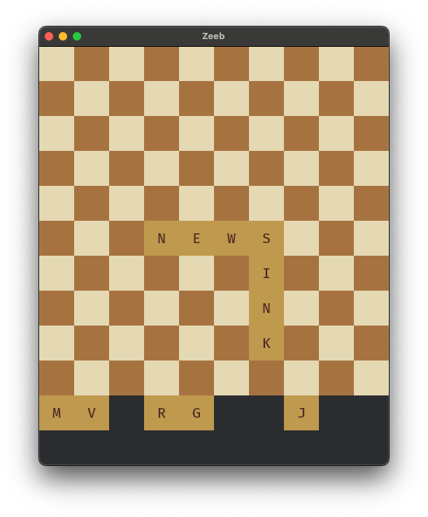

# zeeb

A game based on another (physical) game involving dice, which has been making
rounds on social media of late.

You are given 12 die with letters on them. You must make words out of them in
such a way that the words all connect, a la a crossword puzzle or another game
who shall not be named.

This implementation is built on Bevy in Rust.

## Screenshot

(The tiles don't snap to the grid yet, ignore that :D)

## License

Apache-2.0 OR MIT
